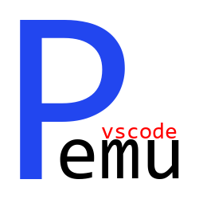
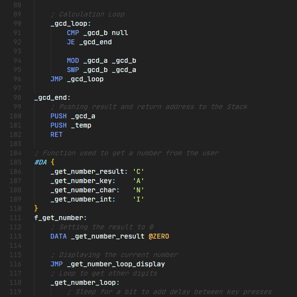

# PEMU Language Extension

## Description:

This is a language extension for VSCode that adds Syntax Highlighting for the PEMU Programming Language which is used by the [PEMU](https://github.com/hds536jhmk/ProcessorEmulator) application.

## What's PEMU?

[PEMU](https://github.com/hds536jhmk/ProcessorEmulator) is an application which Emulates a Processor written in the Java Programming Language.

## Screenshots:

